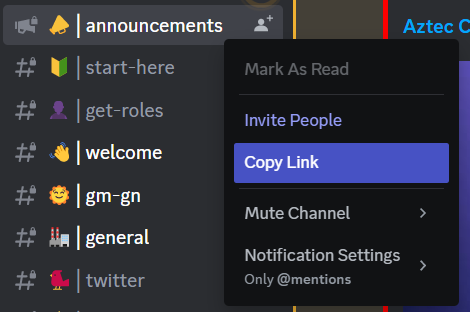

# DiscordCryptoBot
## Информация
Бот использует Discord-аккаунт, который подписан на нужные серверы.
Для удобства, я создал такой аккаунт, данные для входа в аккаунт и его токен перешлю в ЛС.

## Инструкция по запуску бота
1. Создайте бота с помощью @BotFather в Telegram, настройте желаемую метаинформацию
2. Загрузите базу данных в ```resources/database.db``` (пример ```database_example.db```)
3. Задайте настройки в файле ```resources/settings.ini``` (по примеру ```settings_example.ini```):

- TelegramID админов (свой ID можно узнать написав боту "Get my ID")
- Токен бота, полученный на шаге 1
- Токен Discord-аккаунта 

4. Откройте текущую папку в командной строке
5. Настройте среду и зависимости:
   
   Unix:
   ```commandline
   python -m venv .venv
   source .venv/Scripts/activate
   pip install -r requirements.txt
   ```
   Windows:
   ```commandline
   python -m venv .venv
   .venv\Scripts\activate.bat
   pip install -r requirements.txt
   ```

6. Запустите скрипт:
   ```commandline
   python main.py
   ```

## Инструкция по добавлению нового сервера
1. Вступите в сервер с используемого Discord-аккаунта
2. В боте выберите: Админ-панель -> Добавить сервер
3. Введите название сервера
4. Введите ссылку на отслеживаемый канал:



5. Если нужно отслеживать ещё каналы вернитесь к шагу 4, иначе выберите Finish
